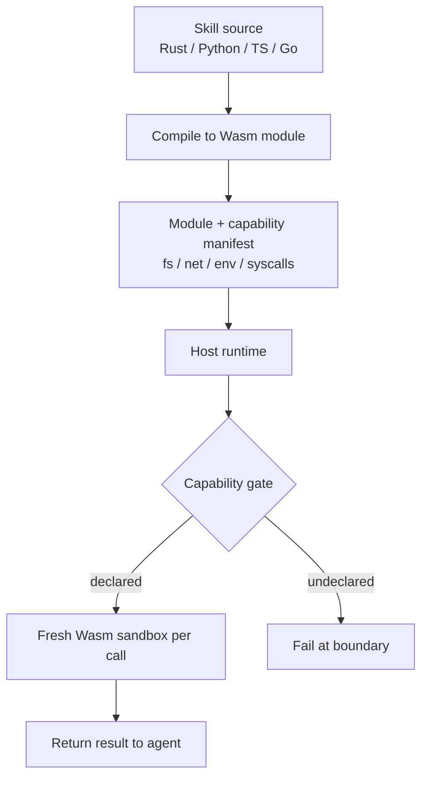

# WebAssembly Skill Runtime

**Also known as:** Wasm Cognitive Skills, Polyglot Skill Sandbox, Capability-Sandboxed Tool Plane

**Category:** Tool Use & Environment  
**Status in practice:** experimental

## Intent

Package each agent skill or tool as a WebAssembly module with an explicit capability manifest, run it inside a Wasm runtime that enforces those capabilities, so untrusted or third-party skills can run in the agent's tool plane without weakening the host's sandbox.

## Context

A team is operating an enterprise agent platform that must accept skills authored by external users or partners and execute them on shared infrastructure. The skills are written in different languages — Rust, Python compiled to a runnable form, TypeScript, Go — and the platform has to enforce per-skill limits on CPU, memory, network access, and filesystem access while still serving them at the rate of incoming agent requests.

## Problem

Running third-party skills as plain in-process code gives them the host's full privileges, which is unacceptable when the author is not fully trusted. Language-specific sandboxes such as a Python sandbox have a long history of escape vulnerabilities and only cover one language at a time. Spinning up a full container per skill invocation is too slow at request rate and too heavy on infrastructure. The team needs a sandbox that is light enough to start per request, language-agnostic enough to cover the polyglot skill set, and strict enough that a hostile skill cannot weaken the host environment.

## Forces

- Skills authored by partners cannot be trusted with host privileges.
- Per-request container start-up is too slow and too expensive.
- Polyglot authoring is a real requirement; Python-only is restrictive.
- Capability declarations have to be checkable, not advisory.


## Applicability

**Use when**

- Enterprise platforms must accept user- or partner-authored skills in multiple languages.
- Per-skill capabilities (filesystem, network, env, syscalls) must be enforced.
- Per-call container overhead is too heavy for request-rate execution.

**Do not use when**

- All skills are first-party and trusted.
- Wasm tooling for the target languages is not mature enough for the workload.
- A simpler sandbox already meets the threat model.

## Therefore

Therefore: ship each skill as a Wasm component with a capability manifest the runtime enforces per call, so that partner-authored or untrusted skills cannot widen the host's sandbox and a fresh isolate spins up faster than a container.

## Solution

Define a Wasm Component Model interface for skills: each skill compiles to a Wasm module and ships with a manifest declaring (filesystem paths, network hosts, env vars, syscalls) it needs. The host runtime instantiates a fresh sandbox per call with only those capabilities. Skills can be authored in any language compiling to Wasm. The host treats the manifest as the contract; missing-capability calls fail at the boundary.

## Example scenario

A team wants to let the community contribute third-party skills to their agent but plain-process tools share the host's privileges and per-skill containers are too heavy. They define a Wasm Component Model interface for skills: each compiles to a Wasm module shipped with a manifest declaring filesystem paths, network hosts, env vars, and syscalls it needs. The Wasm runtime enforces those capabilities. Untrusted skills can run safely alongside trusted ones because a misbehaving skill cannot weaken the host's sandbox.

## Structure

```
Host runtime { capability gate } -> Wasm sandbox(skill_module, manifest) -> deterministic IO -> result.
```


## Diagram



## Consequences

**Benefits**

- Polyglot skill ecosystem with one runtime.
- Strong capability isolation; manifest is the audit surface.
- Wasm cold-start is fast enough to run per request.

**Liabilities**

- Wasm ecosystem maturity per language varies (Rust strong, Python heavier).
- Capability manifest design is the real engineering problem.
- Some workloads (GPU, large data) don't fit Wasm well.

## What this pattern constrains

A skill may not exercise any capability not declared in its manifest; manifest drift is detected at load time.

## Known uses

- **[Aleph Alpha PhariaEngine](https://github.com/Aleph-Alpha/pharia-engine)** — *Available*. Cognitive Business Units (Skills) compile to Wasm and run inside the engine's sandboxed runtime.

## Related patterns

- *specialises* → [sandbox-isolation](sandbox-isolation.md)
- *complements* → [skill-library](skill-library.md)
- *complements* → [tool-discovery](tool-discovery.md)
- *complements* → [secrets-handling](secrets-handling.md)
- *complements* → [code-execution](code-execution.md)

## References

- (repo) *Aleph-Alpha/pharia-engine — Serverless AI powered by WebAssembly*, <https://github.com/Aleph-Alpha/pharia-engine>

**Tags:** tool-use, sandbox, germany-origin, wasm, aleph-alpha
