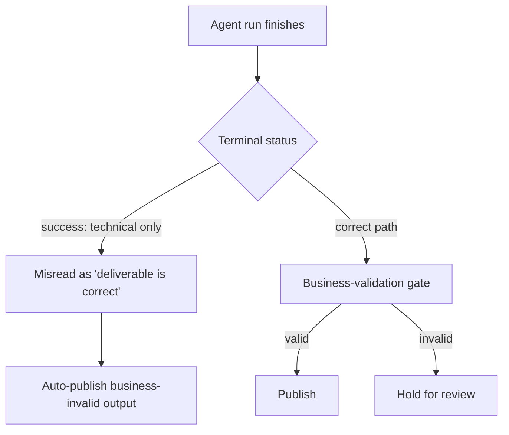

# Workflow-Success vs Business-Validity Gap

**Also known as:** Green-Run Fallacy, Technically-Done-Not-Publishable, Success-Status Means Business-Correct

**Category:** Anti-Patterns  
**Status in practice:** emerging

## Intent

Anti-pattern: a terminal success status from the agent or its workflow engine is read as proof the deliverable is business-correct, when it certifies only technical completion.

## Context

An agent runs inside a workflow or pipeline that publishes a terminal status when the run finishes. The run touched the right files, produced a format the downstream system accepts, raised no exception, and exited cleanly. A controller, a dashboard, or a human watching the queue then treats that green status as the answer to the question that actually matters: is this output something the business can ship.

## Problem

Technical completion and business validity are two different properties, and the exit signal only measures the first. A run that finishes without error has proven that the steps executed, not that the deliverable is right for its purpose: a generated article can be on-format, on-length, and on-time yet factually wrong, off-brand, or unpublishable. When the green status is trusted as a quality verdict, business-invalid output flows downstream unreviewed and is discovered only by a customer, an auditor, or a regulator, long after the run was marked done.

## Forces

- A clean exit is cheap to compute and easy to surface, while business validity needs a separate, slower judgement that the workflow engine cannot make on its own.
- Workflow engines and agent harnesses are built to report execution status, so their strongest, most visible signal is exactly the one that says nothing about correctness.
- Volume pressure pushes operators to clear the queue on the green status alone, because reviewing every run for business correctness is the work the automation was meant to remove.

## Therefore

Therefore (to avoid): never let a terminal success status stand in for a business verdict; add a separate validation layer that checks the deliverable against business rules before it is treated as correct.

## Solution

The remedy is to split the two signals and never collapse them. Keep the workflow's terminal status as a statement about execution only, and add an explicit business-validation step that scores the deliverable against the rules that decide whether it can ship: factual grounding, brand and policy conformance, completeness against the brief, and any domain checks the format alone cannot express. A run that exits cleanly enters a held state pending that validation rather than a published state. Surface the two outcomes separately on the dashboard, so a green execution status with a failing business check is visible as a problem rather than hidden behind a single tick.

## Structure

```
Agent run --exits cleanly--> Terminal status: success (TECHNICAL) --misread as--> 'deliverable is correct' (BUSINESS) ; correct path inserts: --> Business-validation gate --> {valid -> publish | invalid -> hold for review}
```

## Diagram



*A green terminal status certifies execution only; without a business-validation gate, business-invalid output is published.*

## Example scenario

A content agent regenerates marketing pages overnight. Each run reads the brief, rewrites the page, saves it in the CMS format, and exits without error, so the pipeline marks every page 'done'. One morning a customer points out a page that quotes the wrong price and a competitor's name. The run was green: it finished cleanly. Nothing ever checked whether the page was actually right to publish.

## Consequences

**Benefits**

- Naming the gap makes teams ask what a green status actually certifies before they wire it to an auto-publish step.
- It motivates a distinct business-validation layer and observability that reports execution health and deliverable validity as two separate metrics.

**Liabilities**

- Business-invalid output reaches customers, publication channels, or downstream systems because the green status was trusted as a quality verdict.
- Defects are caught late, by audit or complaint, when they are expensive to retract instead of cheap to hold.
- Trust in the whole pipeline erodes after one published error, because operators can no longer tell which green runs are actually safe.

## Failure modes

- Auto-publish on exit — the workflow promotes any cleanly-finished run straight to a live channel with no business check in between.
- Format-passes-so-it-is-right — a schema or CMS-format validation is mistaken for a correctness validation, and on-format but wrong output ships.
- Single-tick dashboard — the only visible signal is execution status, so a business-invalid deliverable is indistinguishable from a correct one.
- Queue-clearing by status — operators under volume pressure approve runs on the green status alone without reading the deliverable.

## What this pattern constrains

A terminal success status must not be treated as a business-correctness verdict; a cleanly-finished run cannot be published or marked correct before a separate business-validation step has checked the deliverable against shipping rules.

## Applicability

**Use when**

- A workflow or agent harness publishes a terminal success status when a run finishes.
- A controller, dashboard, or operator decides what to ship based on that status.
- The deliverable has business-correctness rules that a clean exit and a valid format do not capture.

**Do not use when**

- A separate business-validation step already gates output before it is treated as correct, and the exit status is used only for execution health.
- The deliverable has no business-correctness dimension beyond running successfully, so technical completion is the whole requirement.

## Components

- Workflow engine / agent harness — emits the terminal success status that describes execution only
- Terminal status signal — the green/done state that says the run finished without error
- Misreading controller or operator — the dashboard, auto-publish step, or human that treats the status as a correctness verdict
- Business-validation gate (missing in the anti-pattern) — the separate check of the deliverable against shipping rules
- Downstream channel — the publication target or system of record that receives business-invalid output when the gate is absent

## Tools

- Workflow / pipeline orchestrator — runs the agent and reports completion status
- Business-rules or policy validator — the corrective layer that scores the deliverable against shipping criteria
- Observability dashboard — should surface execution health and deliverable validity as two distinct signals

## Evaluation metrics

- Business-invalid published rate — fraction of green runs whose deliverable later fails a business check or is retracted
- Status-to-validity correlation — how often a success status actually coincides with a business-valid deliverable
- Detection latency — time from clean exit to discovery of a business defect (downstream vs at the gate)
- Auto-publish ratio — fraction of runs shipped on terminal status alone with no business-validation step

## Known uses

- **[Castelis ClawPilot production agent REX](https://www.castelis.com/insights-ressources/rex-pipeline-agents-ia-clawpilot/)** _available_ — Field report on a production content-agent pipeline: a run can follow the instruction, edit the right files, produce a CMS-valid format, and finish without error yet still be business-wrong; 'finished successfully' is explicitly not 'publishable'.
- **[Workflow-engine status semantics (BPMN/agent pipelines)](https://www.fosse.fr/)** _available_ — General observation that workflow and agent runtimes emit a completion/success state describing execution only, leaving business validity to a separate layer the engine does not provide.

## Related patterns

- _complements_ **Phantom Action Completion** — Both are false-success anti-patterns; in phantom completion the side effect never happened, here a real action completed cleanly but the deliverable is business-wrong.
- _complements_ **False Resolution** — Both ship as success while being wrong; false resolution subtly violates a stated constraint, this one passes every technical check yet fails on business validity.
- _alternative-to_ **Supervisor-Plus-Gate** — A validating supervisor that gates output against deterministic business checks before commit is the remedy; this anti-pattern is what its absence produces.
- _alternative-to_ **Deterministic-LLM Sandwich** — Bracketing the run with a deterministic post-check against business rules is the corrective; relying on the bare exit status is the failure it prevents.

## References

- [Agents IA en production : pourquoi un workflow réussi peut livrer un mauvais résultat (REX ClawPilot)](https://www.castelis.com/insights-ressources/rex-pipeline-agents-ia-clawpilot/) — 2025
- [Fosse — agents IA et orchestration en production](https://www.fosse.fr/) — 2025
