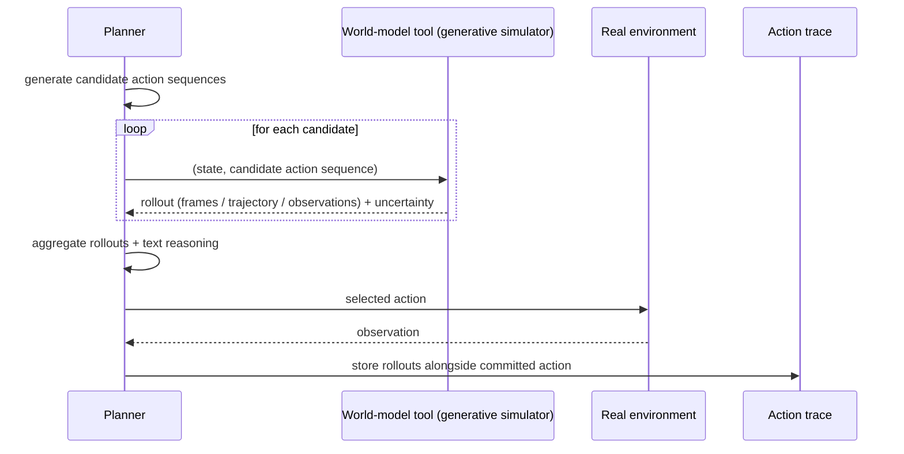

# World Model as Tool

**Also known as:** Foresight Simulator Call, Generative-Sim Lookahead, Dyna-Think, Sim-as-Tool

**Category:** Verification & Reflection
**Status in practice:** experimental

## Intent

Let a planning agent invoke a generative world model (a video, physics, or environment simulator) as an off-the-shelf tool to roll out hypothetical futures before committing to an action, treating the world model as a callable simulator rather than a training target.

## Context

A team builds a planning agent that has to act in an environment where the consequences of an action depend on physics, geometry, or rich perceptual dynamics: a household robot, a game-playing agent, an embodied agent moving in a 3D scene, or a control system over a continuous process. A capable generative world model (a video diffusion model, a learned dynamics model, an external simulator) exists that can produce a plausible rollout when given a description of the current state and a candidate action. Some of the actions the agent might take are irreversible or expensive enough that the team would rather not learn about them by acting first.

## Problem

Text-level lookahead, where the agent just thinks step by step about what would happen if it acted, is weak when the answer depends on physical or perceptual details the model never represented in its text reasoning: whether the glass will tip at the shelf edge, whether the gripper will collide with the cup behind it, whether the lever will jam. The model can write a confident paragraph about either outcome without that paragraph having any contact with the actual dynamics. Training a tightly-integrated world model into the agent itself is expensive and locks the system to one model that quickly becomes stale. Acting without any lookahead is unsafe in environments where mistakes are not cheap to undo. The team needs grounded foresight without paying the cost of training their own world model from scratch.

## Forces

- Text-level reasoning often underrates physical or perceptual consequences of an action.
- Generative world models are improving rapidly and are available off the shelf.
- Training a bespoke world model inside the agent is expensive and quickly stale.
- World-model rollouts are themselves noisy and must not be trusted verbatim as ground truth.
- Many environments are partially irreversible — acting without lookahead is costly.

## Therefore

Therefore: expose the generative world model as a tool the agent can call with a state-and-action description, treat returned rollouts as one more piece of evidence to weigh, and gate irreversible actions on simulator agreement so foresight is grounded without the cost of training a bespoke internal world model.

## Solution

Register the generative world model behind a tool interface: input is a structured description of the current state plus a candidate action sequence; output is a generated rollout (video frames, simulated trajectory, predicted observations) plus optional model-side uncertainty. The planning agent calls this tool when it considers an action whose physical or perceptual consequence is hard to reason about. The agent compares predicted rollouts across candidate actions, weighs them against text-level reasoning, and uses simulator agreement as a gate before any irreversible or expensive action. The world model is treated as fallible — its output is evidence, not truth — and is logged alongside the action for later replay.

## Structure

```
Planner -> generate candidate actions -> for each candidate, call generative world model tool (state, action) -> rollout + uncertainty -> aggregate evidence (rollouts + text reasoning) -> select action -> act in real environment. Rollouts are stored with the action trace.
```

## Diagram



*The planner calls the world model as a tool to roll out hypothetical futures before any irreversible action.*

## Example scenario

A household robot agent considers two candidate plans for placing a glass on a shelf. Before acting, it calls a generative world-model tool with the current scene and each candidate plan. The simulator returns two predicted rollouts; the second shows the glass tipping at the shelf edge with non-trivial probability. The agent picks the first plan and logs both rollouts alongside the action so the team can later audit why the second was rejected. The world model is not perfect, but its output catches a failure that text reasoning over the scene description had missed.

## Consequences

**Benefits**

- Foresight grounded in a real generative simulator, not just text reasoning.
- Decouples the agent from any one world model — swap the tool when a better one ships.
- Adds a meaningful gate in front of irreversible actions in embodied or physical settings.
- Rollouts are inspectable artefacts (video, trajectory) which help debugging and post-hoc review.

**Liabilities**

- Generative world models are slow and expensive to call per step.
- Rollouts hallucinate; treating them as ground truth introduces a new failure mode.
- Encoding the state and action well enough for the world model to simulate is non-trivial.
- Aggregating noisy rollouts with text reasoning is an open design question.

## What this pattern constrains

Rollouts from the world model must be treated as evidence, never as ground truth; the agent must not act on irreversible operations based on simulator output alone, and any acted-on rollout must be logged alongside the action for replay.

## Applicability

**Use when**

- Actions have physical or perceptual consequences the agent cannot reliably reason about in text.
- A capable generative world model is available as an external service or local model.
- Some actions are irreversible enough that even a noisy lookahead pays for itself.

**Do not use when**

- The environment is purely textual and text reasoning already covers consequences well.
- Latency and cost budgets cannot absorb a generative rollout per candidate action.
- No world model with adequate fidelity exists for the task domain.

## Known uses

- **[Dyna-Think (research)](https://arxiv.org/abs/2506.00320)** — *Available* — Synergizing reasoning, acting, and world model simulation in AI agents.
- **[World Model as Tool benchmark (research)](https://arxiv.org/abs/2601.03905)** — *Available* — Empirical study of current agents failing to leverage a world model as a tool for foresight.

## Related patterns

- *complements* → [world-model-separation](world-model-separation.md) — World-model-separation keeps an internal world-state file; world-model-as-tool adds an external generative simulator.
- *complements* → [tree-of-thoughts](tree-of-thoughts.md) — ToT branches over thoughts; world-model-as-tool grounds each branch in a generative rollout.
- *complements* → [lats](lats.md) — LATS uses tree search; world-model-as-tool supplies a richer environment-grounded value signal.
- *specialises* → [tool-use](tool-use.md) — Specialises tool use: the tool is a generative simulator returning a predicted future.

## References

- (paper) *Current Agents Fail to Leverage World Model as Tool for Foresight*, 2026, <https://arxiv.org/abs/2601.03905>
- (paper) *Dyna-Think: Synergizing Reasoning, Acting, and World Model Simulation in AI Agents*, 2025, <https://arxiv.org/abs/2506.00320>

**Tags:** world-model, foresight, simulation, tool-use, embodied
