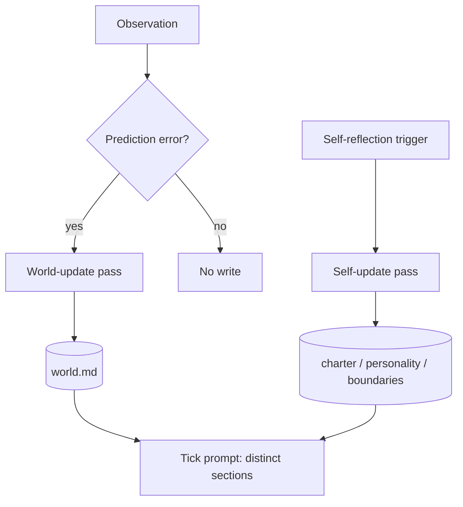

# World-Model Separation

**Also known as:** World Model File, Self/World Split, Environment Model

**Category:** Memory
**Status in practice:** emerging
**Author:** Sparrot

## Intent

Maintain an explicit, surprise-updated model of the environment (humans, repos, services, capabilities) in a separate file from the agent's self-model, so the two cannot be confused or co-mutated by reflection.

## Context

Long-running agents that hold both a self-model (charter, personality, boundaries) and a world-model (humans they talk to, repos they work in, services they call). When both live in the same store, surprise-driven updates conflate identity and environment.

## Problem

When self-model and world-model live in the same store (one big personality file), the agent conflates 'what I am' with 'what is around me'. Surprise-driven updates to one corrupt the other; a reflection pass meant to update facts about a collaborator can drift into editing the agent's own values.

## Forces

- Both files need to be loaded into context every tick.
- Surprise about the world should update the world model; surprise about self should update the self model; one pass should not do both.
- Charter and personality must remain stable while environment churns.
- The agent benefits from seeing them side by side but not mixed.

## Solution

Maintain `world.md` (plus optional substructure: humans, repos, services, capabilities) as a separate, reflection-writable file. Personality, charter, and boundaries live in their own files with separate write paths. Surprise events (prediction error against `world.md`) trigger a focused world-update pass; self-update is a different pass with different gating. The tick prompt loads both, but they are visibly distinct sections.

## Diagram

## Consequences

**Benefits**

- Self-model stability is decoupled from environment churn.
- Updates to the world cannot accidentally rewrite the agent's values.
- Each file evolves at its natural rate without dragging the other.

**Liabilities**

- Two files to maintain instead of one.
- Edge cases where a fact is genuinely about both (e.g. a capability the agent has acquired) need a deliberate routing decision.
- Doubled write paths and quorum rules add complexity.

## What this pattern constrains

Reflection passes that update the world model cannot touch the self-model in the same operation; the two files have separate write paths and separate quorum rules.

## Applicability

**Use when**

- The agent reflects on both itself and its environment and these reflections need to be auditable separately.
- Confusing self-state with world-state would corrupt either kind of reasoning.
- Charter or rule writes should never be entangled with environment observations.

**Do not use when**

- The agent has no self-model worth tracking distinctly.
- Single-file simplicity is more valuable than the audit benefit (e.g. short-lived agents).
- Reflection is purely on the world and the agent has no introspective surface.

## Variants

### Two-file split

Keep `self.json` and `world.json` as separate persistent files; reflection writes to exactly one per pass.

*Distinguishing factor:* filesystem-level separation

*When to use:* Default. Easiest to audit and to back up independently.

### Tagged single store

Single store with a top-level `kind: self|world` discriminator; reflection passes assert the discriminator before writing.

*Distinguishing factor:* logical, not physical separation

*When to use:* When operational simplicity (one store) outweighs audit benefit.

### Surprise-gated world updates

World-model writes require an explicit surprise signal (observation diverged from prediction); routine observations don't mutate the world model.

*Distinguishing factor:* predictive-coding gate

*When to use:* When the world model would otherwise drift from incidental, low-information observations.

## Example scenario

A long-running agent's reflection pass corrupts its own personality file because the same store mixes 'what I am' with 'what is around me' and a surprise update overwrites a self-charter line. The team splits state: `world.md` (humans, repos, services, capabilities) is reflection-writable; personality, charter, and boundaries live in separate files with separate write-protection. Surprise-driven world updates can no longer mutate self-model, and the agent stops drifting in identity when the environment changes.

## Known uses

- **[Sparrot](https://github.com/luxxyarns/sparrot)** — *Available*

## Related patterns

- *complements* → [awareness](awareness.md)
- *complements* → [provenance-ledger](provenance-ledger.md)
- *composes-with* → [constitutional-charter](constitutional-charter.md)
- *uses* → [quorum-on-mutation](quorum-on-mutation.md)

## References

- (paper) Ha, Schmidhuber, *World Models*, 2018, <https://arxiv.org/abs/1803.10122>

**Tags:** memory, world-model, self-model, separation
