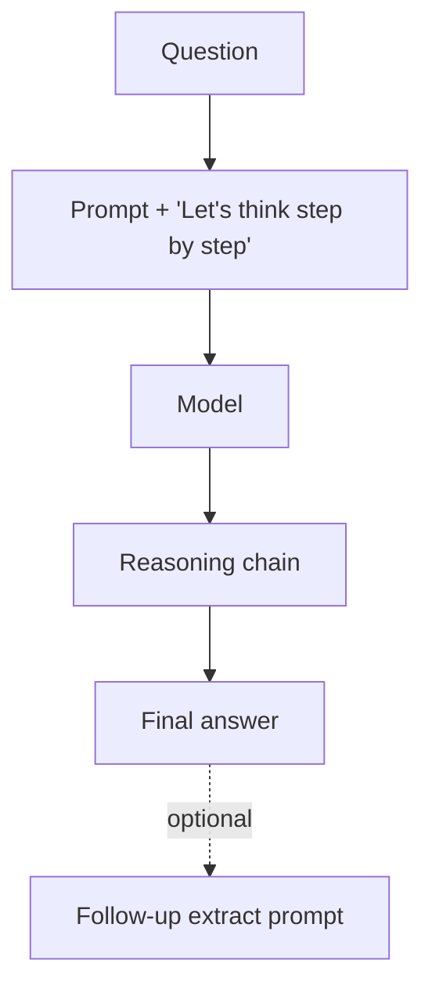

# Zero-Shot Chain-of-Thought

**Also known as:** Let's Think Step by Step, Trigger-Phrase CoT

**Category:** Reasoning  
**Status in practice:** mature

## Intent

Elicit step-by-step reasoning with a single trigger phrase rather than few-shot exemplars.

## Context

A team is building prompts for many different reasoning tasks — dozens or hundreds — where writing carefully crafted few-shot examples with full chain-of-thought traces would be expensive in effort and would have to be redone each time the task changes. They want something close to chain-of-thought quality but without paying the per-task curation cost for every new task type.

## Problem

Few-shot chain-of-thought needs a small set of worked examples for every distinct task; the work of writing and maintaining those examples does not scale across a large portfolio of tasks or a fast-changing product. Without exemplars, however, plain prompting collapses the reasoning into a single output token and quality drops sharply. The team needs a way to trigger step-by-step reasoning that does not depend on supplying task-specific worked solutions in the prompt.

## Forces

- Trigger phrases are model- and language-specific.
- Quality lift is smaller than well-curated few-shot CoT.
- Trigger-phrase reasoning can drift on complex tasks.

## Applicability

**Use when**

- Reasoning tasks where curating few-shot exemplars is impractical or costly.
- A trigger phrase reliably elicits useful chains for the task domain.
- Latency budget allows the model to produce reasoning before the answer.

**Do not use when**

- Few-shot exemplars are available and yield meaningfully better reasoning.
- The trigger phrase produces noisy or irrelevant chains for the task.
- Latency budget forbids the longer reasoning output.

## Therefore

Therefore: append a single trigger phrase to the prompt, so that reasoning emerges without few-shot exemplars when curated demos are unavailable.

## Solution

Append a trigger phrase ('Let's think step by step', 'Let's work through this carefully') to the prompt. The model produces reasoning before its answer with no exemplar required. Optionally extract the final answer with a follow-up prompt.

## Variants

- **Trigger-phrase CoT** — Append a fixed phrase like 'Let's think step by step' to elicit reasoning (Kojima et al. 2022).
- **Optimised trigger CoT** — Replace the human-written phrase with one searched by an automatic prompt optimiser (APE, Zhou et al. 2022).
- **Plan-then-solve CoT** — Two-phase trigger: first 'Devise a plan', then 'Carry out the plan and solve' (Wang et al. 2023, Plan-and-Solve).

## Example scenario

A team is building agent prompts for fifty different tasks and writing few-shot CoT exemplars per task is unaffordable. They append a single trigger phrase ('Let's think step by step') to each prompt; the model produces reasoning before its answer with no exemplars required. Quality on multi-step tasks climbs immediately; for the few tasks where zero-shot CoT is not enough, they reach for few-shot or self-consistency on top.

## Diagram

## Consequences

**Benefits**

- Zero curation cost per task.
- Generalises across task types.

**Liabilities**

- Lower quality lift than well-tuned few-shot CoT.
- Trigger-phrase brittleness.

## What this pattern constrains

The model is required to reason before answering; one-shot answer-only generation is not the target.

## Known uses

- **Zero-Shot CoT paper baseline** — *Available*

## Related patterns

- *specialises* → [chain-of-thought](chain-of-thought.md)

## References

- (paper) Kojima, Gu, Reid, Matsuo, Iwasawa, *Large Language Models are Zero-Shot Reasoners*, 2022, <https://arxiv.org/abs/2205.11916>

**Tags:** reasoning, cot, zero-shot
